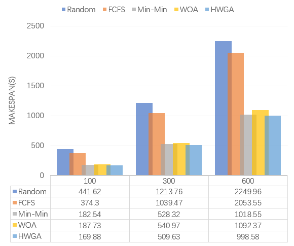

## cloudlet-scheduler
Simulation experiments using CloudSim5.0 toolkit to verify the optimization effect of WOA algorithm and HWGA algorithm using Random algorithm, FCFS algorithm and Min-Min algorithm as benchmarks

### Introduction
- ga: Genetic Algorithm
- [woa](https://github.com/LA4AM12/WOA): Whale Optimization Algorithm
- hwga: Hybrid Whale Genetic Algorithm
- random: Random allocation algorithm
- fcfs: First Come First Served algorithm
- minmin: Min-Min algorithm
- maxmin: Max-Min algorithm

### Benchmarks
#### Single-objective optimization
makespan using different algorithms for different task volumes:

Load balancing degree under different task volumes using different algorithms:

Execution time of virtual machines using different algorithms:

#### Multi-objective optimization
Comparison of fitness values of WOA and HWGA algorithms under different number of iterations:

Comparison of fitness values of WOA and HWGA algorithms at different population sizes:
